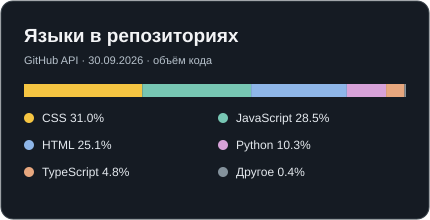
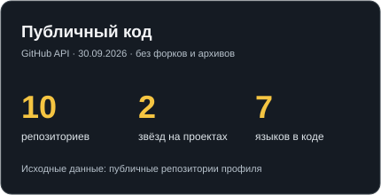

# Привет, я Артём Назаров

Разрабатываю Python-бэкенд для сайтов и внутренних систем: API, работа с данными, доступ сотрудников, интеграции. Для интерфейсов использую JavaScript и TypeScript.

- Сейчас ищу задачи по Python backend.
- Работал с CRM-аналитикой, административными панелями и учётом посещаемости. Часть коммерческого кода закрыта по NDA.
- Посмотреть работы: [портфолио](https://giveaway-one.ru/) · [репозитории](https://github.com/an724275-hash?tab=repositories)
- Связаться: [Telegram](https://t.me/ave93) · [email](mailto:an724275@gmail.com)

### Чем пользуюсь

`Python` `Django` `FastAPI` `PostgreSQL` `SQLite` `REST API` `JavaScript` `TypeScript` `React` `Next.js` `Docker` `Linux` `Git`

### Проекты

| Проект | Что делает | Ссылки |
| --- | --- | --- |
| **Смена** | Учёт заявок на ремонт: статусы, сметы, история действий, фильтры и API на чтение. Django-сервер запускается локально, публичное демо использует тестовые данные. | [Демо](https://an724275-hash.github.io/service-desk-django/) · [Код](https://github.com/an724275-hash/service-desk-django) |
| **Site Watch** | Проверяет доступность сайтов и время ответа. Показывает историю сбоев и разбирает CSV-экспорт поисковых запросов. Публичная панель работает на GitHub Pages, FastAPI запускается локально. | [Демо](https://an724275-hash.github.io/site-watch-python-js/) · [Код](https://github.com/an724275-hash/site-watch-python-js) |
| **План комнаты** | 2D-редактор планировки с мебелью, проверкой пересечений, отменой действий и экспортом JSON/SVG. Геометрия покрыта тестами. | [Демо](https://an724275-hash.github.io/room-planner-ts/) · [Код](https://github.com/an724275-hash/room-planner-ts) |
| **Firefox Session Lab** | Локальный Python-скрипт для сравнения сохранённых сессий Firefox, поиска вкладок и экспорта результатов. | [Код](https://github.com/an724275-hash/firefox-session-lab) |

### На GitHub

<table>
  <tr>
    <td></td>
    <td></td>
  </tr>
</table>

Карточки строятся из [публичных данных GitHub API](https://docs.github.com/en/rest/repos/repos#list-repositories-for-a-user). В статистику входят мои публичные репозитории, кроме форков, архивов и этого профиля. Доли языков отражают объём кода, а не уровень владения языком. [Скрипт обновления](tools/update_stats.py) запускается автоматически раз в неделю.
